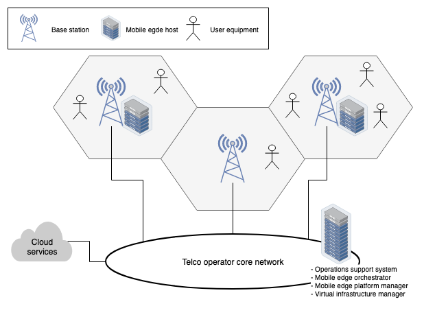
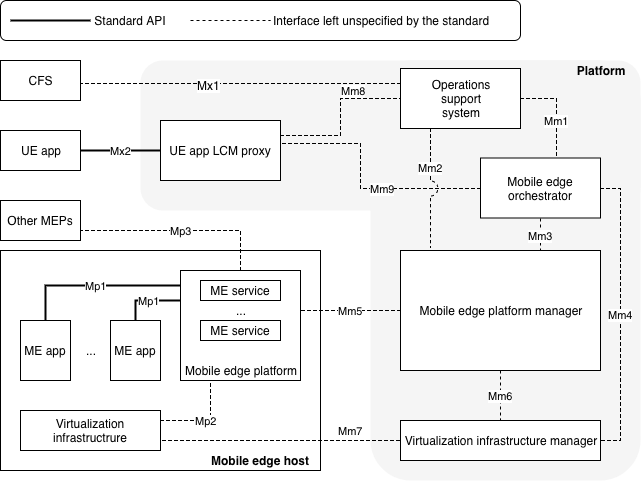
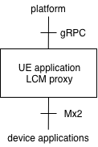

# uiiit::etsimec



## Description

A partial work-in-progress implementation of the [ETSI MEC](https://www.etsi.org/technologies/multi-access-edge-computing) APIs in C++.

This library is used to provide the serverless architecture developed by the [Ubiquitous Internet research group at IIT-CNR](http://cnd.iit.cnr.it/) (not _yet_ released to the public) with an ETSI MEC interface. For more details on this research activity see [here](https://ccicconetti.github.io/cloudcom2018.html) and [here](https://ccicconetti.github.io/percom2019.html).

## Background

The ETSI MEC consists of a set of reference documents defining an architecture to support interoperable edge computing services in a multi-access environment. The reference architecture (v1.1) is illustrated in the figure below.



An ETSI MEC platform allows a device application to interact with Mobile Edge (ME) applications and services residing on edge nodes, e.g. co-located with base stations in a cellular network or hosted in application servers provisioned by the network infrastructure owner to boost the performance of users by exploiting computation close to them.
ETSI has defined a set of vendor-independent REST APIs that allow the vendors of user devices/applications and edge node applications to interoperate.
As of release 1.1 only two interfaces are defined (depicted as thick lines in the figures above): *Mx2* for the communication between user applications and the ETSI MEC platform, via a Life Cycle Management (LCM) proxy; *Mp1* for the communication between ME applications and services.
More details are available in the [ETSI MEC wiki](https://mecwiki.etsi.org/index.php?title=Main_Page).

The current version of this library only support Mx2.

## Build instructions

1. Clone the git repository:

```
git clone https://github.com/ccicconetti/etsimec.git
cd etsimec
git submodule update --init --recursive
```

2. Install dependencies (see below)

3. Compile (assuming `g++` is your preferred compiler):

```
cd build/debug
../build.sh g++
make
```
Note that [gmock](https://github.com/google/googlemock) is also needed to compile the unit tests but, if everything goes right, it will be downloaded automatically by CMake (needless to say: you do need a working Internet connection for this step).

This will compile the full build tree consisting of:

1. `Executables`: example executables (see below)
2. `EtsiMec`: library to used within your code
2. `Test`: unit tests, which you can execute with `Test/testetsimec`

If you want to compile with compiler optimisations and no assertions:

```
cd build/release
../build.sh g++
make
```

The unit tests will not be compiled (gmock will not be even downloaded).

### Dependencies

Compiling the software requires the following:

- recent C++ compiler, tested with clang-10 and cc-7
- [CMake](https://cmake.org/) >= 3.2
- [glog](https://github.com/google/glog), tested with 0.3.5
- [Boost](https://www.boost.org/), tested with 1.65
- [gRPC](https://grpc.io/), tested with 1.27.1
- [protobuf](https://developers.google.com/protocol-buffers/), tested with version shipped with gRPC 1.27.1

With Mac OS X this should be as simple as installing everything via [Homebrew](https://brew.sh/):

```
brew install grpc protobuf cpprestsdk boost glog
```

On Linux this is a bit more complicated. A script that downloads and installs all dependencies can be found in the repo, which assumes that you are using `Ubuntu 18.04 (Bionic)`. Note that the script requires root privileges, it will change the system default CMake version to 3.16.1, and it will install headers and libraries in the system path `/usr/local`. To run it just hit (from within the cloned `etsimec` repository):

```
[sudo] utils/build_deps.sh
```

from the same directory where you have cloned the repository.

## How to use in your code

Assuming you use CMake in your project:

1. Include the full git source tree in your project as a submodule under `etsimec`

```
git submodule add git@github.com:ccicconetti/etsimec.git
```

2. Add the following directives to your `CMakeList.txt` to compile the dependencies:

```
add_subdirectory(etsimec/EtsiMec)
add_subdirectory(etsimec/rest/Rest)
add_subdirectory(etsimec/rest/support/RpcSupport)
add_subdirectory(etsimec/rest/support/Support)
```

3. Add the include paths:

```
include_directories(${CMAKE_CURRENT_SOURCE_DIR}/etsimec)
include_directories(${CMAKE_CURRENT_SOURCE_DIR}/etsimec/rest)
include_directories(${CMAKE_CURRENT_SOURCE_DIR}/etsimec/rest/support)
```

4. For all your tagers that use the uiiit::etsimec library add

```
target_link_libraries(YOURLIBRARY
  YOUR_OTHER_DEPENDENCIES
  uiiitetsimec
  uiiitrest
  uiiitrpc
  uiiitsupport
```

Alternatively you may just copy the header files in your header inclusion path, copy the compiled libraries in your library inclusion path.
However, the method above is preferrable because the dependencies stay together with your code and, if improvements/fixes are made to the libraries, you just have to update the submodule.

## List of executables

### ETSI MEC client

The `etsimeccli` queries an ETSI MEC UE application LCM proxy via its Mx2 interface.
Currently supports only the application list command.
The API root URI is specified via the `--etsi-api-root` command-line option.

### ETSI MEC UE application LCM proxy

The `ueapplcmproxy` acts as an ETSI MEC UE application LCM proxy responding to application list commands and application context creation/deletion via the Mx2 interface.
It also notifies the user applications that specified a notification URI as the end-point of an edge application changes.
It is configured via a gRPC north-bound interface, see [ueapplcmproxy.proto](EtsiMec/ueapplcmproxy.proto).
The interfaces of the proxy are illustrated in the figure below.



The proxy stores internally three tables.

1. A table of applications that are returned to the device applications querying the list of applications. This table can be modified via the `addLambda`/`delLambda` gRPC methods.
2. A table of end-points that are notified to the device applications depending on their address. Specifically, the table maps an edge client address (also _any_ edge client address) and an application name to an end-point. Device applications requesting a context to be created for a given application are return the most specific end-point matching their address, or a failure message if the application is not supported at all for them. This table can be modified via the `associatedAddress`/`removeAddress` gRPC methods.
3. The current active contexts, which can be retrieved via the `numContexts`/`contexts` gRPC methods.

### Example

Create an ETSI MEC LCM UE application LCM proxy:

```
./ueapplcmproxy &
```

This creates a server listening to `http://localhost:6500/`.

Now add a new application called test1:

```
echo "add-lambda test1" | ./ueapplcmproxyclient
```

Retrieve the list of applications with the ETSI MEC client:

```
./etsimeccli

```

The output is:

```
test1, OpenLambdaMec, 1.0
```

To associate all edge clients requesting `test1` application to a service responding to`localhost:10000`:

```
echo "associate * test1 localhost:10000"| ./ueapplcmproxyclient
```

The current association table can be retrieved via:

```
echo table | ./ueapplcmproxyclient
```

whose output is:

```
* test1 localhost:10000
```

A specific edge client, e.g. 10.0.0.1, can be forced to go to another end-point (e.g. `remotehost:10001`) via:

```
echo "associate 10.0.0.1 test1 remotehost:10001" | ./ueapplcmproxyclient
```

The association table now is:

```
10.0.0.1 test1 remotehost:10001
* test1 localhost:10000
```

which means that if `10.0.0.1` requests a context to be created for a `test1` application it will be directed to `remotehost:10001`. If it specifies a notification URI and later on the latter association is removed, the UE application LCM proxy will automatically notify the device application to migrate from `remotehost:10001` to `localhost:10000` which would be the only valid option.
